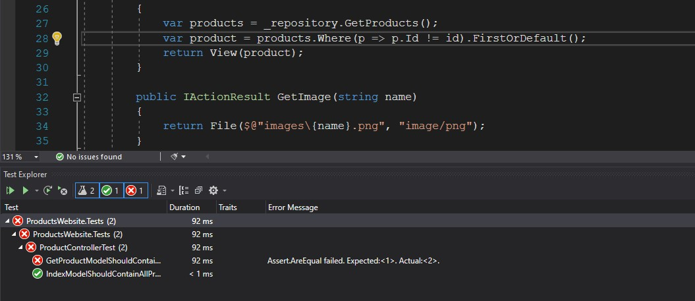
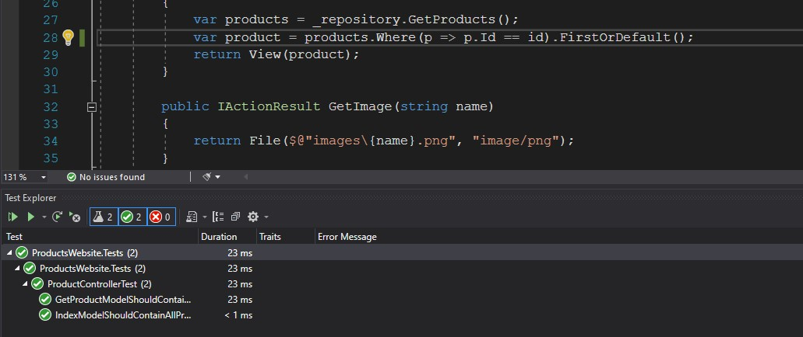

# Tareas del MOC

## Module 10: Testing and Troubleshooting

# Lesson 1: Testing MVC Applications

### Demonstration: How to Run Unit Tests

- Creamos un nuevo proyecto de test
- Creamos una clase **FakeProductRepository** con los datos de prueba
- En la clase **ProductControllerTest** añadimos los metodos de prueba
- Ejecutamos y comprobamos que falla el metodo **GetProductModelShouldContainTheRightProduct**

Cambiamos la condicion donde falla, volvemos a ejecutar y comprobamos que pasa las pruebas

